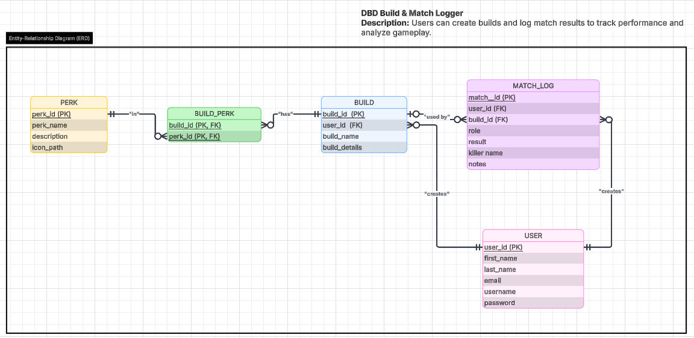
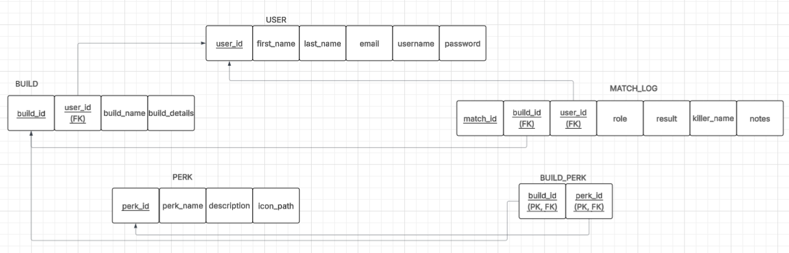

## Purpose
The purpose of this application is to help Dead by Daylight players track the builds they use and log match results in an organized way. Instead of relying on memory, users can save perk combinations and record how their matches go over time. The app allows players to analyze which builds perform best against specific killers or in certain situations.

---

## Intended Users
This application is designed for Dead by Daylight players who want to track performance, experiment with different builds, and review match outcomes. It is useful for both casual and competitive players looking to improve their gameplay.

---

## Main Entities
- Users  
- Builds  
- Match Logs  

*(For this version of the project, the primary focus is on Builds and Match Logs.)*

---

## Key Features / User Actions
- Users can register for an account  
- Users can log in to their account  
- Users can create, view, edit, and delete saved builds  
- Users can create, view, edit, and delete match logs  
- Users can search their match history by killer name, map, result, or notes  

### Match Filtering Options
- Role (Survivor or Killer)  
- As / Against (Played as killer or faced a killer)  

### Match Log Details
Each match log can include:
- Role played  
- Killer name  
- Match result  
- Notes  

---

## Current Implementation
- Static frontend built using HTML and CSS  
- Structured dashboard layout with forms and match history  
- Navigation system between register, login, and dashboard pages  
- Styled using Flexbox and CSS Grid  
- Placeholder system for builds, perks, and match logs  

---

## Potential Future Improvements
- Display official perk and add-on icons  
- Store perk descriptions in a database  
- Allow users to select perks from a predefined list  
- Add statistical analysis (win rate per killer, best-performing build, etc.)  
- Implement advanced search and filtering using database queries  
- Add hover-based perk descriptions and interactive UI elements  

---

## Technologies Used
- HTML  
- CSS  
- Git & GitHub  

---

## Author
Sean Wilk

---

## Business Rules 
This diagram lists the business rules that define how the entities relate to one another, such as how one user can create many builds or match logs, and how builds and perks are connected through the BUILD_PERK table. Its purpose in database design is to formally describe the constraints and cardinality of relationships so the database accurately reflects the real-world rules of the application.

---

## Entity Relationship Diagram (ERD)
This is the completed Entity-Relationship Diagram for the DBD Build & Match Logger database. It visually represents the entities, their attributes, primary keys, foreign keys, and relationship cardinalities using crow’s foot notation. Its purpose in database design is to serve as the final blueprint for creating the database tables, enforcing relationships, and ensuring the database is logically organized and normalized.

---

## Relations Diagram
This diagram shows the main entities in the database system, including USER, BUILD, MATCH_LOG, PERK, and BUILD_PERK, along with their attributes and foreign key relationships. Its purpose in database design is to give a clear visual outline of how the tables are connected before implementation, helping identify primary keys, foreign keys, and the overall structure of the database.

